# Relacionamentos e integridade

## Mapa lógico

As relações abaixo são inferidas das colunas e entidades observadas. A
existência de constraints `FOREIGN KEY` no MySQL deve ser confirmada pelo DDL.

```mermaid
erDiagram
    partner ||--o{ user : possui
    partner ||--o{ partner_api_link : configura
    partner ||--o{ partner_feed_event : publica
    partner ||--o{ camera : possui
    partner ||--o{ partner_camera_link : cadastra
    partner ||--o{ traffic_light : monitora
    traffic_light ||--o{ traffic_light_snapshot : registra
    partner ||--o{ waze_alerts : recebe
    partner ||--o{ waze_jams : recebe
    partner ||--o{ waze_tvt_route : acompanha
    waze_tvt_route ||--o{ waze_tvt_sub_route : divide
    waze_tvt_route ||--o{ waze_tvt_route_snapshot : historico
    waze_tvt_route ||--o{ waze_tvt_irregularity : irregularidades
    waze_tvt_route ||--o{ waze_tvt_user_on_jam : registros
    partner ||--o{ weather_location : configura
    weather_location ||--o{ weather_observation : registra
    partner ||--o{ cemaden_station_link : configura
    cemaden_station_link ||--o{ cemaden_pluviometric_observation : registra
    partner ||--o{ cemaden_hidro_station_link : configura
    cemaden_hidro_station_link ||--o{ cemaden_hidro_observation : registra
    user ||--o{ reset_password_request : solicita
```



## Vínculos principais

| Origem | Coluna | Destino esperado | Cuidado |
| --- | --- | --- | --- |
| `user` | `partner_id` | `partner.id` | Pode ser `NULL`; definir claramente o alcance desses usuários. |
| `partner_feed_event` | `created_by_user_id`, `updated_by_user_id` | `user.id` | Campos opcionais; validar autorizações no código. |
| `traffic_light_snapshot` | `traffic_light_id` | `traffic_light.id` | Volume histórico elevado; planejar retenção. |
| `waze_tvt_sub_route` | `route_id` | `waze_tvt_route.id` | Não confundir com identificador externo textual. |
| `waze_tvt_route_snapshot` | `route_id` | `waze_tvt_route.id` | Mesmo snapshot também guarda `waze_route_id` textual. |
| `waze_tvt_irregularity` | `route_id`, `sub_route_id` | Rota e sub-rota locais | `sub_route_id` aceita `NULL`; revisar deduplicação. |
| `weather_observation` | `weather_location_id` | `weather_location.id` | Confirmar que `partner_id` coincide nos dois registros. |
| `cemaden_pluviometric_observation` | `cemaden_station_link_id` | `cemaden_station_link.id` | Confirmar coerência de `partner_id`. |
| `cemaden_hidro_observation` | `cemaden_hidro_station_link_id` | `cemaden_hidro_station_link.id` | Confirmar coerência de `partner_id`. |

## Verificação das constraints

```sql
SELECT
    TABLE_NAME,
    COLUMN_NAME,
    CONSTRAINT_NAME,
    REFERENCED_TABLE_NAME,
    REFERENCED_COLUMN_NAME
FROM information_schema.KEY_COLUMN_USAGE
WHERE TABLE_SCHEMA = 'u629736858_trafik'
  AND REFERENCED_TABLE_NAME IS NOT NULL
ORDER BY TABLE_NAME, COLUMN_NAME;
```

## Verificação de divergência entre parceiros

```sql
SELECT COUNT(*) AS observacoes_com_parceiro_divergente
FROM weather_observation o
JOIN weather_location l ON l.id = o.weather_location_id
WHERE o.partner_id <> l.partner_id;

SELECT COUNT(*) AS snapshots_com_parceiro_divergente
FROM waze_tvt_route_snapshot s
JOIN waze_tvt_route r ON r.id = s.route_id
WHERE s.partner_id <> r.partner_id;

SELECT COUNT(*) AS observacoes_cemaden_com_parceiro_divergente
FROM cemaden_pluviometric_observation o
JOIN cemaden_station_link l ON l.id = o.cemaden_station_link_id
WHERE o.partner_id <> l.partner_id;
```

Resultado esperado para as três consultas: `0`. Antes de corrigir qualquer
registro, identificar a origem da divergência na coleta.
